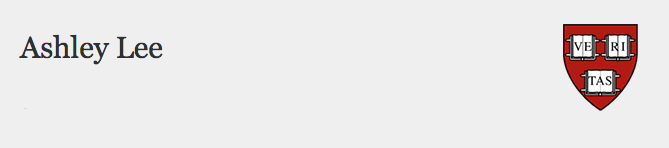

<html>
    

<body>
  <h2>About Me</h2>
  
I am a civic media scholar whose work examines technology, politics, and social inequality in comparative perspective. I have ongoing projects in the areas of: 1) new media and youth movements across democratic and non-democratic countries; 2) technology, design, and social justice; 3) digital labor and the future of work.

<h2>Ongoing Projects</h2>

<h3>New Media and Youth Movements in Comparative Perspective</h3>
  I am currently completing a qualitative study of 120 youth activists across democratic and non-democratic countries. I examine how young activists leverage social media to participate in movements while navigating surveillance and other forms of control in the digital age. This work is financially supported by the Social Sciences and Humanities Research Council, the Weatherhead Center for International Affairs, the Asia Center, and several other grants and scholarships. I have also designed and taught a graduate seminar on this topic.
  
  <h3>Technology, Design, and Social Justice</h3>
  
  In light of the advances in AI, this project investigates how we might design technologies for social justice. This work is informed by my own professional experience as a software engineer in Silicon Valley. I have led workshops and presentations on technology design and social justice at the International Communication Association, the Graduate School of Design, the Kennedy School, and the Edmond J. Safra Center for Ethics. 
  
  <h3>Digital Labor and the Future of Work</h3>
  This initiative inquires into digital labor and the changing nature of work in the platform economy. This new project builds on my past work with the UN in the areas of decent work, worker organizing, and human rights. I contributed to developing new undergraduate courses on the future of work.
  
  

  </body>

</html>
