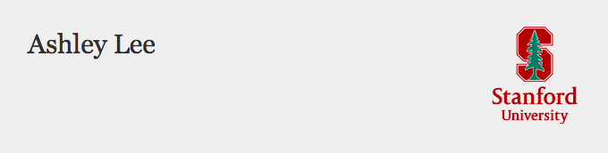

<html>
    

<body>
  <h2>About Me</h2>
  
My research broadly examines technology and politics in comparative perspective. I have ongoing research projects in the areas of: 1) new media and social movements across democratic and non-democratic contexts; 2) digital labor and the future of work; 3) technology, design, and social justice. In 2020-2021, I will be teaching the Digital Civil Society series in the Department of Communication. 

<h2>Ongoing Projects</h2>

<h3>New Media and Social Movements in Comparative Perspective</h3>
  I am currently completing a comparative study of youth activists across democratic and non-democratic contexts. I examine how young activists leverage social media to participate in movements while navigating surveillance and other forms of control in the digital age. This research has been financially supported by the Social Sciences and Humanities Research Council, the Weatherhead Center for International Affairs, the Asia Center, and the Spencer Foundation, among others. 
  
  <h3>Digital Labor and the Future of Work</h3>
  This initiative inquires into digital labor and the changing nature of work in the platform economy. This new project builds on my work with the UN in the areas of decent work, worker organizing, and human rights. 

  <h3>Technology, Design, and Social Justice</h3>
  
  In light of the advances in AI, this project investigates how we might design technologies for social justice. This work is informed by my professional experience as a software engineer in Silicon Valley. I have led workshops on technology design and social justice at the Graduate School of Design, the Kennedy School, and the Edmond J. Safra Center for Ethics. 
    
  

  </body>

</html>
